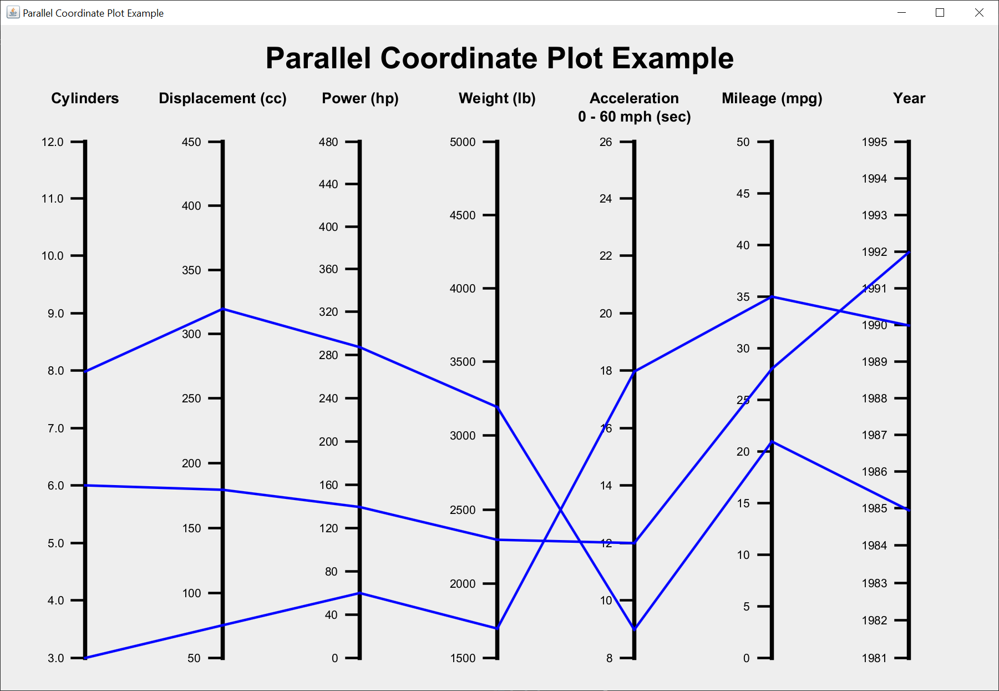

# Parallel Coordinate Plot

Recently on [Stack Overflow](https://stackoverflow.com/questions/72976821/how-to-plot-parallel-coordinate-plot-using-java-swing-we-can-also-use-jzy3d-li?noredirect=1#comment128918913_72976821), someone asked for a Java Swing parallel coordinate plot.  He provided some pictures of various plots.

It looked like a fairly simple process to create a parallel coordinate plot, so I gave it a go.  Here's what I came up with.

The parallel coordinate plot creation requires that a plot model be completed before the plot is drawn.  The plot model requires:

- A `Dimension` for the drawing `JPanel`.
- A `String` array of coordinate titles.
- A `NumberRange` array of coordinate ranges.
- At least one `Number` array of coordinates.

The plot model has an optional plot title.

A `String` coordinate title can be broken on multiple lines by inserting a ` ` where you want the text to break.  This is used by the parallel coordinate plot model as a line separator symbol that just happens to be the same as the HTML ` `.  That should make it easy to remember.

You must create the same number of coordinate ranges as you have coordinate titles.

The coordinates array must have the same number of values as you have coordinate titles.

Here's the actual model code I used to create the drawing.

		String[] coordinateTitles = { "Cylinders", "Displacement (cc)", "Power (hp)",
				"Weight (lb)", "Acceleration 0 - 60 mph (sec)",
				"Mileage (mpg)", "Year" };
		NumberRange cylinderRange = new DoubleRange(3, 12, 1, 1);
		NumberRange displacementRange = new IntegerRange(50, 450, 50);
		NumberRange powerRange = new IntegerRange(0, 480, 40);
		NumberRange weightRange = new IntegerRange(1500, 5000, 500);
		NumberRange accelerationRange = new IntegerRange(8, 26, 2);
		NumberRange mileageRange = new IntegerRange(0, 50, 5);
		NumberRange yearRange = new IntegerRange(1981, 1995, 1);
		NumberRange[] coordinateRanges = { cylinderRange, displacementRange,
				powerRange, weightRange, accelerationRange, mileageRange,
				yearRange };
		Number[] coordinates1 = { 3.0, 75, 60, 1700, 18, 35, 1990 };
		Number[] coordinates2 = { 6.0, 180, 140, 2300, 12, 28, 1992 };
		Number[] coordinates3 = { 8.0, 320, 289, 3200, 9, 21, 1985 };
		
		model.setDrawingPanelDimension(new Dimension(1200, 800));
		model.setTitle("Parallel Coordinate Plot Example");
		model.setCoordinateTitles(coordinateTitles);
		model.setCoordinateRanges(coordinateRanges);
		model.addCoordinate(coordinates1);
		model.addCoordinate(coordinates2);
		model.addCoordinate(coordinates3);
    
# Explanation

Oracle has a helpful tutorial, [Creating a GUI With Swing](https://docs.oracle.com/javase/tutorial/uiswing/index.html).  Skip the Learning Swing with the NetBeans IDE section.

Basically, I created a parallel coordinate plot model and a drawing `JPanel`.  I also created an example `JFrame` to test the drawing `JPanel` and show how to use the parallel coordinate plot.  Creating a good model makes creating the Swing GUI so much easier.

You have to complete the parallel coordinate plot model before you can create the Swing GUI.

## Model

The parallel coordinate plot model consists of one interface and three concrete classes.

The `NumberRange` is an interface that allows me to create an `int` range with the `IntegerRange` class and a `double` range with the `DoubleRange` class.  `Number` is a parent of both `Integer` and `Double`.

Both range classes take a minimum, maximum, and increment.  The minimum is plotted at the bottom and the maximum is plotted at the top.  The increment allows me to place tick marks and labels at the appropriate locations.

The `DoubleRange` class also has a precision parameter.  This parameter is the number of decimal places to display.

You must create a range for each coordinate title.  The number of ranges must match the number of coordinate titles.

## View

I created a drawing `JPanel`.  I created an example `JFrame` to test the drawing `JPanel` and give an example of how to use the parallel coordinate plot.  The `JFrame` just shows the drawing `JPanel`.
